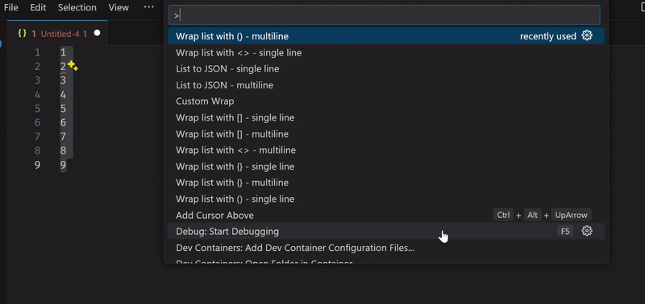
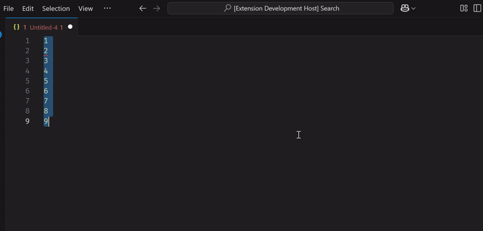

# listo README

Using vs-code to structure big lists?
Maybe you are creating a list for:
* `$in` for MongDB - `$in: ['a', 'b', 'c', ...]`
* `IN` for an SQL query `IN ('a', 'b', 'c', ...)`
* killing sessions in an RDBMS `KILL 1; KILL 2; KILL 3; ...`

This extension allows for easy and quick list creation from new-line separated values.

## Features

* Wrap new-line separated values with:
  * parentheses
  * square-brackets
  * angle-brackets
  * curly brackets
  * any custom values

Basic Wrappers

Custom Wrapper
